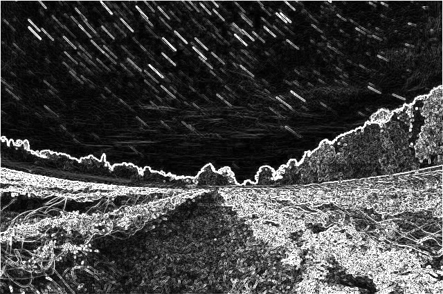
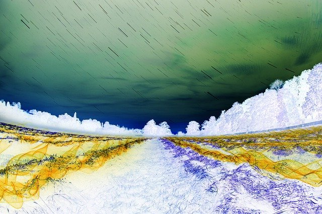

# Shader Usage Examples

The following table demonstrates the output of various shader and mask combinations applied to the input image.

| Command                                                               | Shader          | Mask     | Result                                  |
| :-------------------------------------------------------------------- | :-------------- | :------- | :-------------------------------------- |
| _Original Input File_                                                 | **Input Image** | N/A      |                      |
| `./build/main examples/input.ppm examples/output.ppm box`             | Box             | None     |                          |
| `./build/main examples/input.ppm examples/output.ppm gauss`           | Gauss           | None     |                      |
| `./build/main examples/input.ppm examples/output.ppm motion`          | Motion          | None     |                    |
| `./build/main examples/input.ppm examples/output.ppm dither-10`       | Dither-10       | None     |              |
| `./build/main examples/input.ppm examples/output.ppm dither-60`       | Dither-60       | None     |              |
| `./build/main examples/input.ppm examples/output.ppm grayscale`       | Grayscale       | None     |              |
| `./build/main examples/input.ppm examples/output.ppm sobel`           | Sobel           | None     |                      |
| `./build/main examples/input.ppm examples/output.ppm inversion`       | Inversion       | None     |              |
| `./build/main examples/input.ppm examples/output.ppm mirror`          | Mirror          | None     |                    |
| `./build/main examples/input.ppm examples/output.ppm cpu-convolution` | CPU Convolution | None     |  |
| `./build/main examples/input.ppm examples/output.ppm sobel radial`    | Sobel           | Radial   |        |
| `./build/main examples/input.ppm examples/output.ppm sobel gradient`  | Sobel           | Gradient |    |
